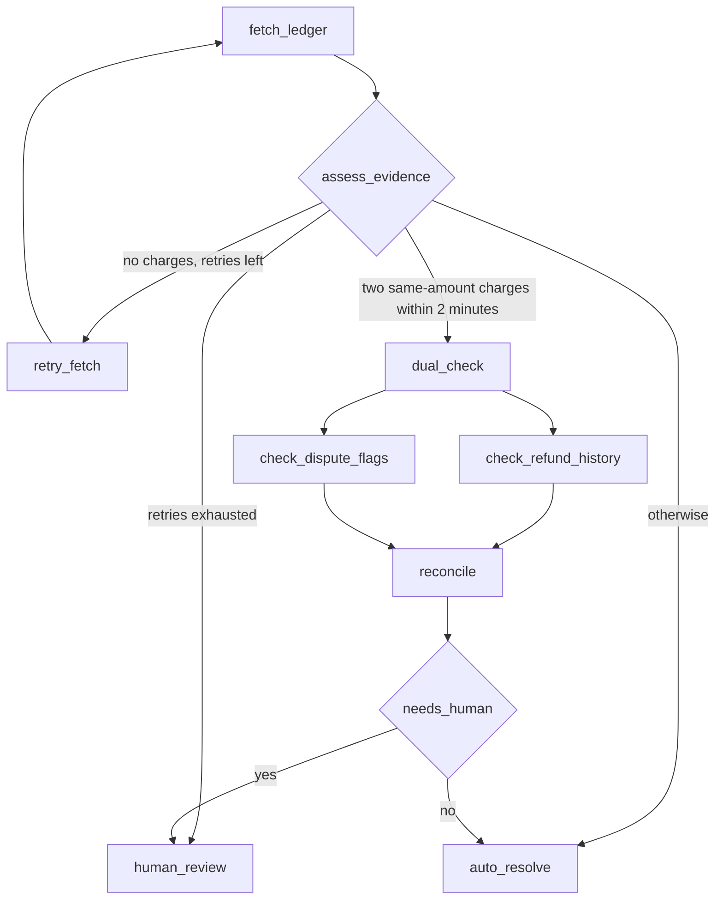

# Billing Investigation Specialist

A specialist agent that investigates disputed billing transactions. It is built as a **LangGraph** state machine and exposed over the **Agent2Agent (A2A)** protocol, so another agent can discover it, hand it a case, and collect the result without sharing any code.

It is called by the [Support Triage Agent](https://github.com/Sameors/support-triage) (link: adjust to your repo URL) through a tool named `invoke_specialist`. The triage agent only ever speaks MCP. This repo is the other side of that handoff.

## Why it exists

The Support Triage Agent has a confidence gate (`propose_resolution`) with three layers. Layer 1 is a hard rule: **every billing ticket is blocked** and would normally be escalated to a human, even when the case is a simple duplicate charge.

That is expensive. This specialist gives the triage agent a second option before it escalates. When a blocked billing ticket carries an `order_id`, the triage agent asks the specialist to investigate. The specialist checks the ledger, refund history and dispute records for that order, and either:

- **resolves the case automatically** when the evidence is clean, or
- **pauses for a human** when the evidence is ambiguous or conflicting.

The governance stays intact. Nothing about the confidence gate is weakened; the specialist only runs after the gate has blocked.

## How it fits together

```
Support Triage Agent (separate repo)              This repo
------------------------------------              ---------------------------------
mcp_agent_loop.py  (model decides)
   |  MCP tool call
   v
invoke_specialist  (A2A client)  -- HTTP -->  a2a_server.py  (Flask, :8001)
   fetch Agent Card                              /.well-known/agent.json
   POST /tasks                                   /tasks, /tasks/<id>, /tasks/<id>/input
   poll GET /tasks/<id>                              |
                                                     v
                                                 graph.py  (LangGraph + SqliteSaver)
                                                     |  HTTP
                                                     v
                                                 mock_ledger.py  (Flask, :8000)
```

The two agents live in separate repositories with no shared imports. The only contract between them is the Agent Card and the task lifecycle.

## What the specialist does



- **fetch_ledger** calls the ledger service over HTTP. A connection failure is recorded as `connection_failed`, kept separate from a legitimate "no charges for this order" answer.
- **assess_evidence** is a router. No charges triggers the retry cycle (up to 5 retries). Two charges with the same amount less than 2 minutes apart look like a duplicate and go to the deeper checks. Anything else resolves directly.
- **dual_check** fans out to two independent checks that run in parallel: refund history and dispute flags.
- **reconcile** joins the two results and decides whether a human is needed, recording the reason. If either service was unreachable, it also asks for a human.
- **human_review** calls `interrupt()`. The graph stops, its state is saved to disk, and it waits.
- **auto_resolve** records a `resolve` decision with a reason.

## A2A interface

The server runs on port 8001.

| Endpoint | Purpose |
|---|---|
| `GET /.well-known/agent.json` | The Agent Card: name, description, skills, base URL |
| `POST /tasks` | Start an investigation. Body: `{"order_id": "A1123"}`. Returns a `task_id` and a status |
| `GET /tasks/<task_id>` | Poll the status and, once finished, the result |
| `POST /tasks/<task_id>/input` | Supply a human's decision for a paused task. Body: `{"decision": "escalate"}` |

Task states follow the A2A vocabulary: `input-required` while paused for a human, `completed` when done. The task returns immediately either way. It never holds an HTTP connection open while a human decides.

## Mock services and test orders

`mock_ledger.py` (port 8000) stands in for the real billing systems. It serves `/ledger/<order_id>`, `/refund-history/<order_id>` and `/dispute-flags/<order_id>`.

| Order ID | Evidence | Expected outcome |
|---|---|---|
| `A1123` | Two duplicate-looking charges, clean refund history, no related dispute | Resolves automatically |
| `B2001` | Two duplicate-looking charges, a related open dispute | Pauses for a human |
| `B2002` | Two duplicate-looking charges, prior refunds on record | Pauses for a human |

## What this repo demonstrates

- A real **retry cycle** driven by a live HTTP call, with infrastructure failures kept apart from business outcomes.
- **Conditional routing** on inspected state, with routers separated from the nodes that compute the facts they read.
- **Parallel fan-out and join** with separate state keys per branch.
- **Human-in-the-loop** through `interrupt()` and `Command(resume=...)`, backed by a SQLite checkpointer.
- **Pause and resume across processes.** `src/pause.py` starts a run and exits; `src/resume.py`, a fresh process, picks the same run up from `checkpoints.db`.
- A minimal **A2A server** exposing the graph as a task that can outlive a single request.

## Run it locally

Requirements: Python 3.10 or newer.

```powershell
python -m venv .venv
.venv\Scripts\Activate.ps1
pip install langgraph langgraph-checkpoint-sqlite flask requests
```

Run each of these in its own terminal, with the venv active:

```powershell
python src\mock_ledger.py     # port 8000
python src\a2a_server.py      # port 8001
```

Then start a case and answer it the way a reviewer would:

```powershell
# Clean case: completes immediately
Invoke-RestMethod -Uri "http://localhost:8001/tasks" -Method Post -ContentType "application/json" -Body '{"order_id": "A1123"}'

# Ambiguous case: returns status "input-required" and a task_id
Invoke-RestMethod -Uri "http://localhost:8001/tasks" -Method Post -ContentType "application/json" -Body '{"order_id": "B2001"}'

# Supply the human decision for that task
Invoke-RestMethod -Uri "http://localhost:8001/tasks/<task_id>/input" -Method Post -ContentType "application/json" -Body '{"decision": "escalate"}'
```
Acceptance baseline: see docs/acceptance-baseline/
To run the graph without HTTP, use `src\pause.py` and `src\resume.py` directly.

## Screenshots

Add these before publishing:

- [ ] Agent Card in the browser
- [ ] `POST /tasks` returning `input-required`
- [ ] Final `completed` result after the human decision
- [ ] The LangSmith trace of a run

## Known limitations

These are deliberate scope decisions, not oversights.

- **The specialist contains no LLM.** All routing is deterministic Python. The value here is the orchestration, the A2A surface and the human-review flow.
- **Data is mocked.** The ledger, refund and dispute services return hardcoded records.
- **The task store is an in-memory dict.** The graph's state survives a restart because it is in SQLite, but the map of task IDs to task status does not.
- **Clients poll for status.** SSE streaming and webhooks are not implemented. A webhook would suit tasks that wait a long time for a human.
- **The Agent Card gives the base URL and skills, but not the endpoint paths.** Clients know `/tasks` by convention.
- **No authentication.** Local use only.
- **`SqliteSaver` is a single-file store.** A shared deployment would use Postgres or Redis with the same interface.
- **The unreachable refund and dispute service branch of `reconcile` has not been exercised in isolation.** Its structure mirrors the ledger failure handling, which has been tested.

## Repository layout

```
src/
  graph.py             LangGraph specialist and SQLite checkpointer
  a2a_server.py        Agent Card and task endpoints
  mock_ledger.py       Mock ledger, refund and dispute services
  pause.py             Start a run and stop at the human-review interrupt
  resume.py            Resume that run from a new process
learn/                 Scratch work (not part of the service)
```
